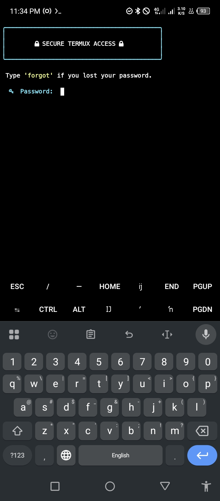
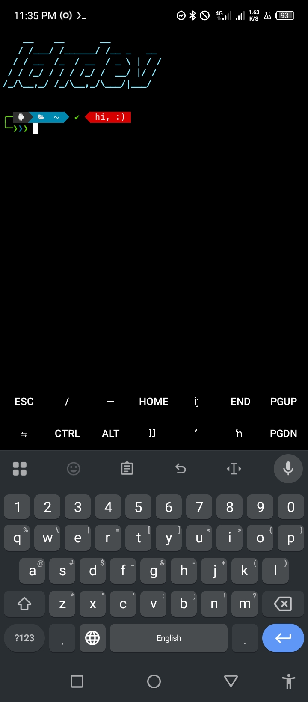
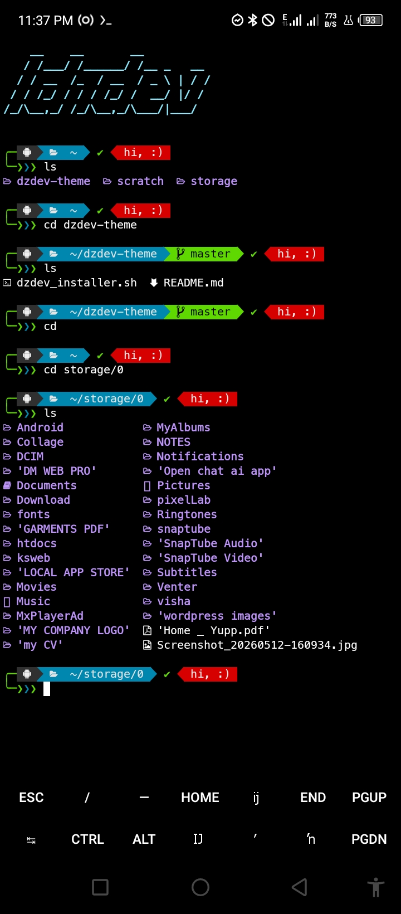
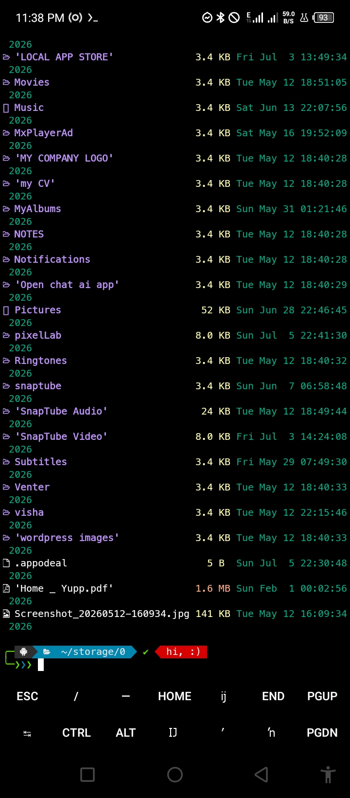

# 🎨 dzdev Termux Theme

Welcome to the **dzdev Ultimate Termux Theme!** 

This project completely overhauls the standard Termux CLI into a stunning, highly-visual, modern terminal experience using **pure Bash** (no Zsh required) without overriding core system binaries.

## 📸 Screenshots
<p align="center">
  
  
  <br>
  
  
</p>

## ✨ Features
* **Native Powerlevel10k Clone**: Get the gorgeous, framed Powerline prompt look without needing Oh-My-Zsh.
* **Bank-Grade Login System**: Features an ASCII lock-screen on startup with SHA256 hashed passwords and a built-in "forgot password" recovery system!
* **Modern File Manager**: Replaces standard cluttered `ls` outputs with a clean, GUI-like table interface (Folders first, Icons, Sizes, Dates) powered by LSDeluxe.
* **Vibrant Tokyo Night Palette**: Custom hex colors injected straight into the Termux engine.
* **Nerd Fonts Integration**: Native support for high-quality terminal icons.

## 🚀 One-Line Installation

To install this theme on any fresh Termux app, simply copy and paste this command into your terminal:

```bash
curl -sL https://raw.githubusercontent.com/dzshowrav/dzdev-theme/master/dzdev_installer.sh | bash
```


## 🛠️ Usage
* **Login System**: 
  * On first boot, you will be prompted to set a password and a security question. 
  * Next time, you must enter it to unlock the shell. If you lose it, type `forgot`.
  * Type `lock` at any time to instantly lock the terminal and bring up the password screen.
  * Type `logout` to securely exit and close the Termux session.
* **File Manager**: Simply type `ls`, `la`, or `ll` to see the beautiful new file browsing layout.
* **Smart Prompt**: Features a dynamic rotating globe (`🌍 🌎 🌏`) and git integration showing branches and repo status right in the command line!

---
## 🗑️ How to Remove
To completely remove the theme and restore standard Termux, run:
```bash
rm -f ~/.termux/font.ttf ~/.termux/colors.properties ~/.termux_login.sh ~/.termux_auth_data ~/.bashrc_prompt ~/.bashrc && termux-reload-settings
```

---
*Built with passion by dzdev.*
